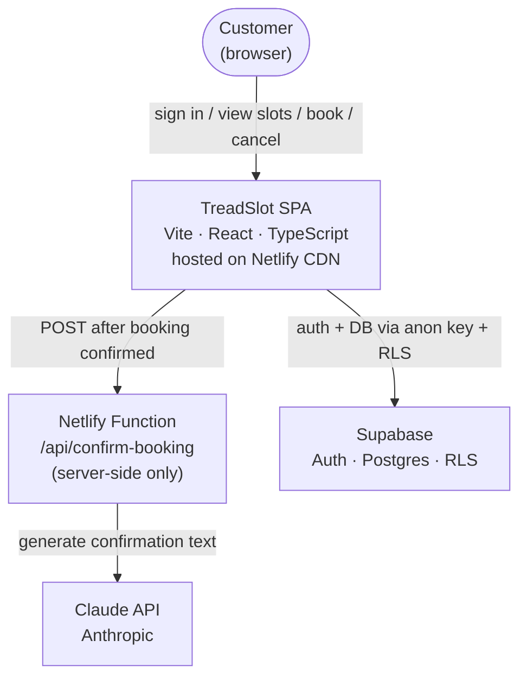
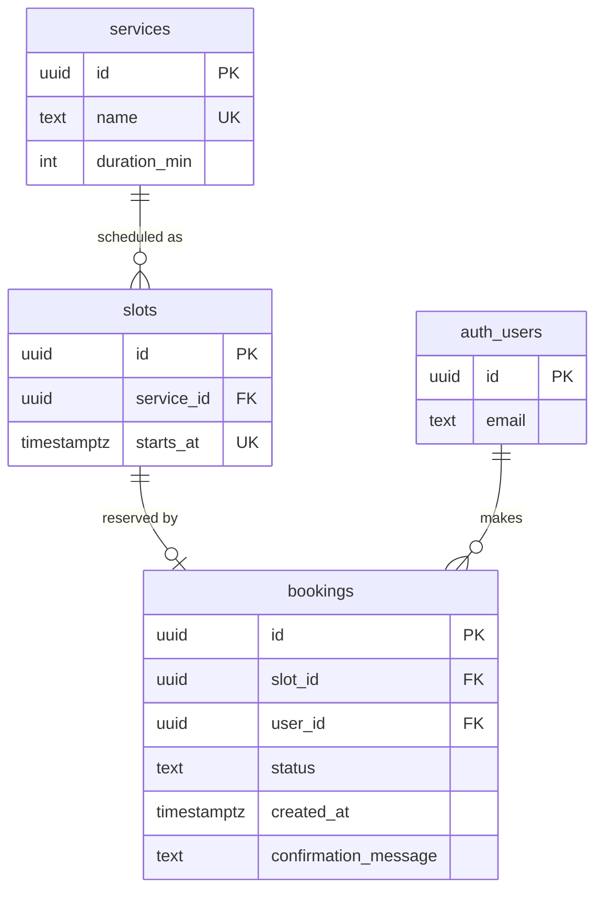
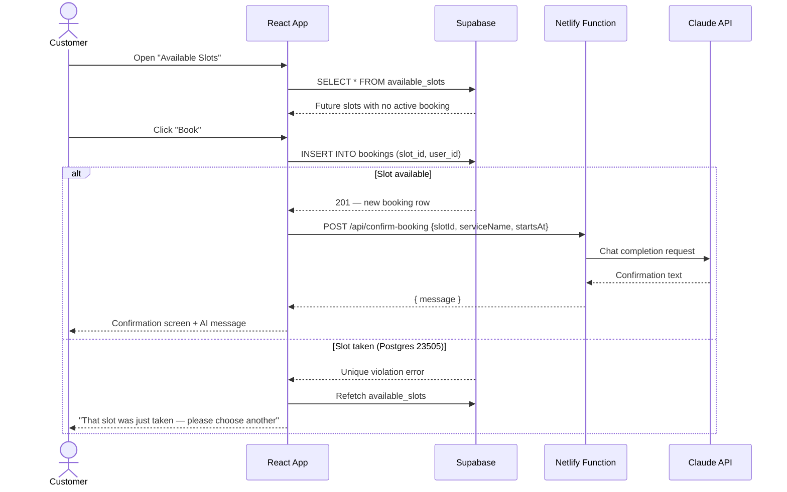
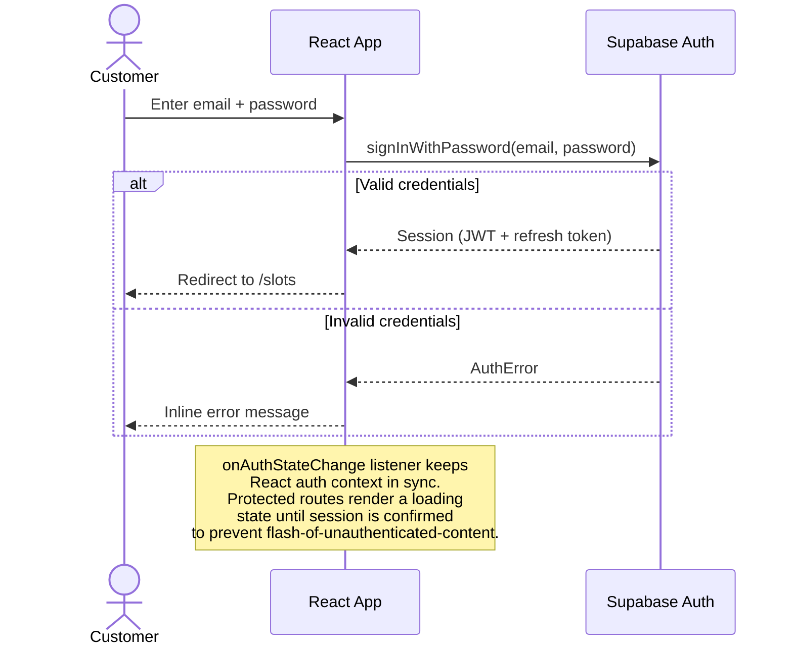

# Architecture

## Assumptions

The following decisions were made deliberately and are documented here so the evaluator can see the reasoning, not just the result.

1. **Slots are pre-seeded** — no admin UI for creating slots. A `generate_series` seed populates weekday 9 AM–4 PM slots for the next 7 days. A production app would replace this with an admin scheduling tool.
2. **One booking per slot globally** — one technician, one customer per slot. The `unique (starts_at)` constraint on `slots` encodes this assumption at the schema level.
3. **A customer may hold multiple bookings** — no per-customer limit is enforced beyond the slot uniqueness constraint.
4. **Single timezone** — all times are stored and displayed in UTC. A production app would resolve the customer's local timezone.
5. **Email + password auth only** — Supabase's built-in email provider. Email confirmation is disabled for demo speed; it would be enabled in production.
6. **Claude confirmation message is cosmetic** — the booking is committed before the Claude API call. A Claude failure logs a warning but does not roll back the booking.
7. **No payment integration** — out of scope.
8. **Responsive web only** — not a PWA or native app.

---

## System Context



**Why a Netlify Function for Claude?**
The `ANTHROPIC_API_KEY` must never appear in the browser bundle — it would be visible in devtools to any user. The Netlify Function is the only server-side boundary in this stack, so it is the only place the key is used. All other data flows go directly from the React app to Supabase, protected by RLS.

---

## Database Entity Relationship



`slots.starts_at` carries a `unique` constraint — one slot per start time (single-technician model).

`bookings.slot_id` carries a partial unique index `where status = 'booked'` — only one active booking per slot; cancellation releases the slot without deleting any rows.

---

## Booking Flow



---

## Cancellation Flow

```mermaid
sequenceDiagram
    actor C as Customer
    participant FE as React App
    participant SB as Supabase

    C->>FE: Open "My Bookings"
    FE->>SB: SELECT * FROM bookings WHERE user_id = auth.uid()
    SB-->>FE: Customer's own bookings (RLS enforced)

    C->>FE: Click "Cancel" on a booked slot
    FE->>SB: UPDATE bookings SET status = 'cancelled' WHERE id = {id}
    note over SB: USING: user_id = auth.uid() AND status = 'booked'<br/>WITH CHECK: user_id = auth.uid() AND status = 'cancelled'
    alt Cancellation accepted
        SB-->>FE: Updated row
        FE-->>C: Booking marked cancelled; slot now available to others
    else Already cancelled or not owner
        SB-->>FE: Zero rows updated (RLS filtered the row)
        FE-->>C: No visible change (idempotent)
    end
```

---

## Auth Flow



---

## Frontend Module Structure

```
src/
  lib/
    supabase.ts        # Supabase client singleton (reads VITE_ env vars)
  contexts/
    AuthContext.tsx    # Session state + onAuthStateChange listener
  hooks/
    useAvailableSlots.ts   # TanStack Query: SELECT available_slots
    useMyBookings.ts       # TanStack Query: SELECT bookings (own)
    useCreateBooking.ts    # Mutation: INSERT + POST to Netlify Function
    useCancelBooking.ts    # Mutation: UPDATE status = 'cancelled'
  pages/
    SignIn.tsx
    Slots.tsx          # Available slots list
    MyBookings.tsx     # Customer's booking history
  components/
    SlotCard.tsx
    BookingCard.tsx
    ProtectedRoute.tsx
  App.tsx              # Router + QueryClientProvider + AuthProvider
netlify/
  functions/
    confirm-booking.ts  # Claude API call; ANTHROPIC_API_KEY lives here only
```

Each hook owns one query or mutation. Pages compose hooks — they do not query Supabase directly. This keeps data-fetching logic testable and co-located with its cache key.

---

## Technology Choices

| Concern | Choice | Rationale |
|---|---|---|
| Build tool | Vite | Fast HMR; first-class TypeScript; standard for React in 2025 |
| Auth + DB | Supabase | Postgres + RLS + Auth in one service; generated TypeScript types reduce runtime errors |
| Hosting | Netlify | Git-push deploys; Functions for server-side secrets; free tier sufficient |
| Server-side | Netlify Functions | Sole purpose: keep `ANTHROPIC_API_KEY` out of the browser bundle |
| Data fetching | TanStack Query | Automatic cache invalidation after mutations; built-in loading/error states |
| AI | Claude API (claude-haiku-4-5-20251001) | Fast, cheap, sufficient for a one-sentence confirmation message |

---

## Intentional Omissions

These are conscious decisions, not gaps:

| Omitted | Reason |
|---|---|
| Booking cancellation email | Requires Supabase Edge Function + email provider; time cost exceeds demo value |
| Admin slot management UI | Slots are seeded; admin CRUD is out of scope |
| OAuth providers | Email/password demonstrates the auth integration cleanly |
| Timezone handling | All UTC; documented as a production gap |
| Unit / integration tests | Cuts into documentation time, which the evaluator weighs heavily |
| Rate limiting on the Netlify Function | Production concern; noted as a gap |
| Re-booking guard | A customer can cancel and immediately re-book; acceptable for this scope |
